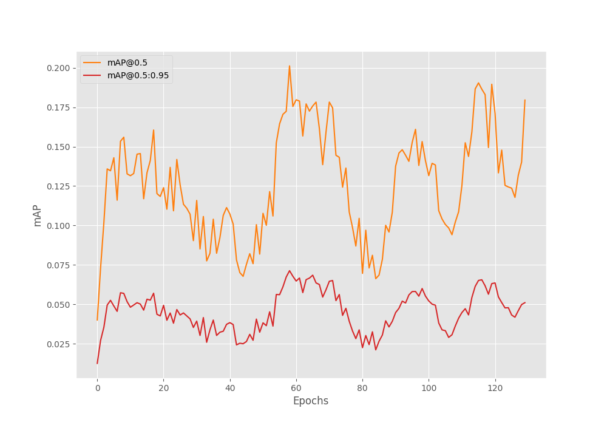
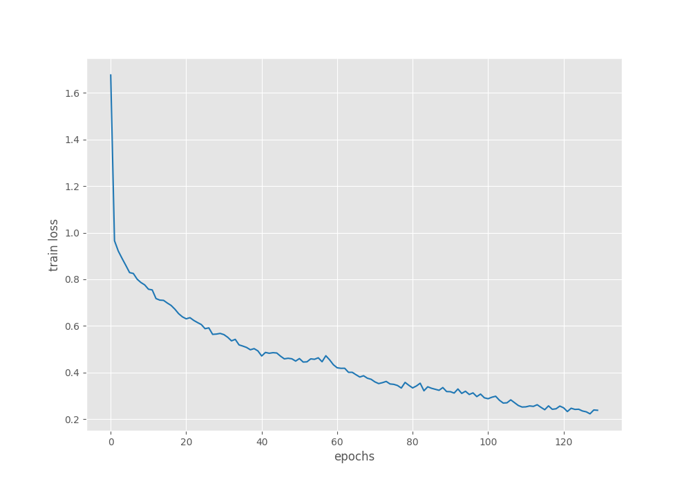
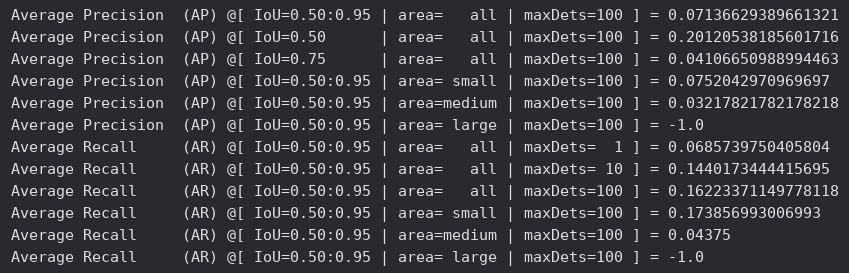
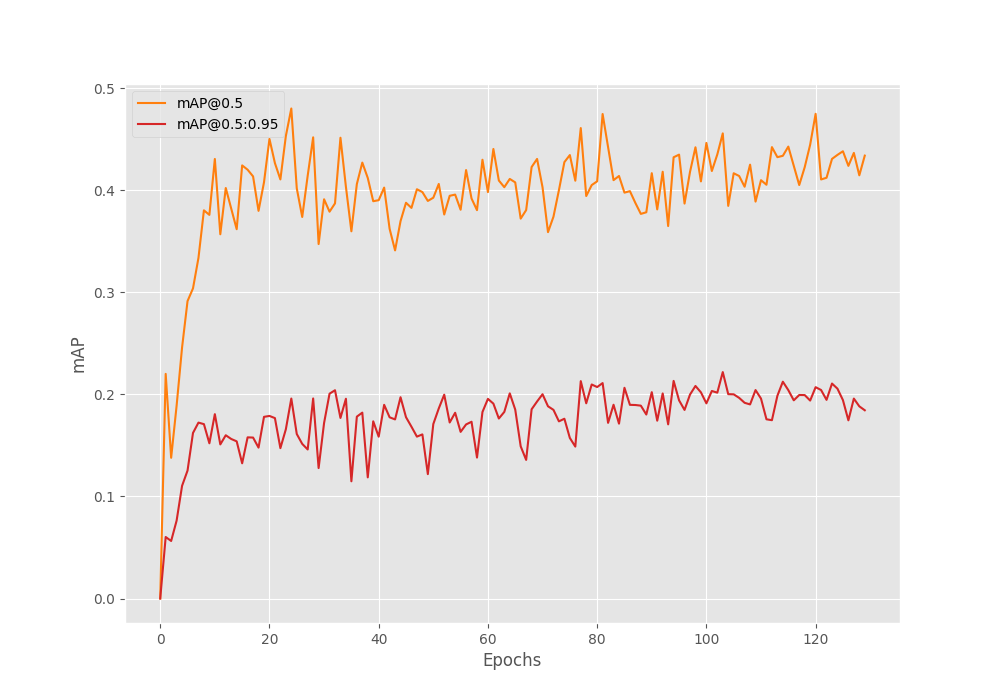
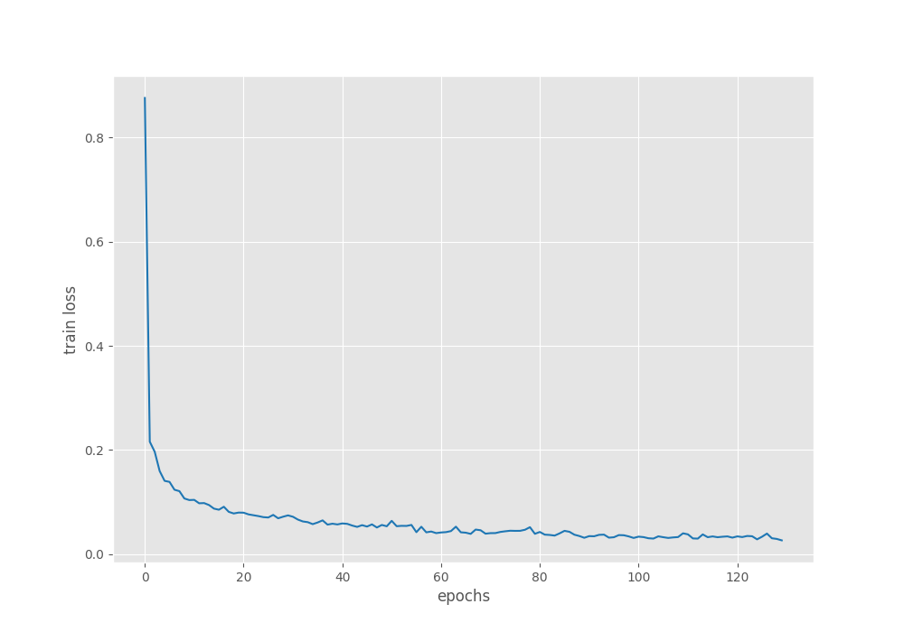
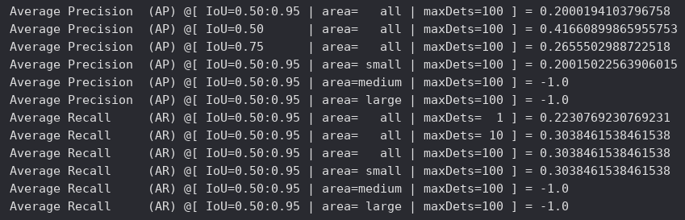

## Detector de Acne Facial

Este projeto trata da implementação de um sistema de detecção de acnes a partir de imagens faciais, utilizando o modelo FastRCNN com o backbone ResNet50.

O sistema, quando tem seu modelo devidamente configurado e treinado, possui um script que aceita como entrada várias imagens faciais e gera como resultado as imagens de entrada com bounding boxes nas regiões onde o modelo detectou as espinhas.

Estrutura de arquivos do projeto:
```bash
├── metrics_data/
├── data/
├── torch_utils
│   ├── coco_eval.py
│   ├── coco_utils.py
│   ├── engine.py
│   └── utils.py
├── results/
├── acne.yaml
├── dataset.py
├── inference.py
├── split_dataset.py
├── train.py
├── requirements.txt
└── README.md
```

## Principais Tecnologias Utilizadas e Funcionamento Geral

A biblioteca PyTorch foi utilizada para importar, configurar e realizar o fine-tuning do modelo Fast R-CNN com o backbone pré-treinado ResNet50. O modelo Fast R-CNN foi escolhido para este projeto pois apresenta um excelente desempenho, o que facilitou bastante o treinamento, mesmo com um hardware inapropriado, além de possuir boa precisão para lidar com objetos pequenos e ser bastante popular entre a comunidade.

A biblioteca Matplotlib foi utilizada para plotar gráficos com base nas métricas geradas pelo modelo durante as etapas do treinamento.

Como backbone para o modelo Fast R-CNN, foi utilizado o ResNet50, que, de forma simples, é a parte do sistema responsável por extrair características relevantes das imagens que são enviadas ao modelo durante o treinamento.

A biblioteca Albumentations foi utilizada para aplicar filtros no conjunto de dados (dataset) durante as etapas do treinamento. Ou seja, antes de cada imagem passar pelo modelo, um determinado filtro é aplicado, de forma aleatória, com o objetivo de aumentar a capacidade de generalização do modelo.

Como dito anteriormente, foi realizado um fine-tuning do modelo escolhido. Essa escolha foi feita pois, utilizando pesos pré-treinados, o modelo ganha a capacidade de identificar bordas, texturas e cores, fazendo com que menos trabalho precise ser feito para detectar os objetos escolhidos.

### Principais Hiperparâmetros Utilizados para Treinamento do Modelo

| Hiperparâmetro     | Valor    | Descrição                                                                                    |
|--------------------|----------|----------------------------------------------------------------------------------------------|
| Workers Number     | 4        | Número de workers usados para carregar os dados durante o treinamento.
| Batch Size         | 2        | Quantidade de imagens processadas por vez durante o treinamento (último valor utilizado).
| Epochs             | 130      | Quantidade total de épocas para o treinamento (último valor utilizado).
| Learning Rate      | 0.001    | Taxa de decaimento do gradiente descendente para que o loss seja reduzido e os erros sejam eliminados.
| Image Width        | 640      | Largura para redimensionamento das imagens de entrada (último valor utilizado).
| Image Heigth       | 640      | Altura para redimensionamento das imagens de entrada (último valor utilizado).

## Instruções para Instalação

1. Execute os comandos abaixo para clonar o repositório para a máquina local, criar e ativar o ambiente virtual Python. Os comandos abaixo foram criados com base na utilização em um sistema Linux (Ubuntu), então pode ser necessário adaptá-los caso esteja utilizando outro sistema operacional:

```bash
git clone https://github.com/paulohenrique64/fastrcnn-resnet50-acne-detector.git
cd fastrcnn-resnet50-acne-detector
python3 -m venv ./.venv
source .venv/bin/activate
pip install -r requirements.txt
```

2. Vá até o link do Google Drive e baixe um dos datasets disponíveis:

[https://drive.google.com/drive/folders/1GDCG7E1I73PRiAJjNJZ-AFPTrLJMAaIH?usp=sharing](https://drive.google.com/drive/folders/1GDCG7E1I73PRiAJjNJZ-AFPTrLJMAaIH?usp=sharing)

Certifique-se de substituir o diretório `data` (vazio) pelo novo diretório data baixado.

Será necessário alterar o arquivo `acne.yaml` de acordo com o dataset baixado. Para isso, deixe descomentadas somente as configurações referentes ao dataset escolhido:

```yaml
[...]

# Dataset 1-classe-105-images-dataset-pascal-voc
# CLASSES: [
#     '__background__',
#     'acne',
# ]

# # Quantidade de classes que o modelo deve detectar
# NC: 2

# Dataset 5-classes-260-images-dataset-pascal-voc
CLASSES: [
    '__background__',
    'dark_spot',
    'flat_red_area',
    'red_bump',
    'white_bump',
    'deep_bump',
]

# Quantidade de classes que o modelo deve detectar
NC: 6
```

3. Após configurar o arquivo `acne.yaml`, execute o script `split_dataset.py` para dividir o dataset em dados de treino, validação e teste:

```bash
python split_dataset.py
```

4. Pode ser interessante ajustar os hiperparâmetros de acordo com as preferências. Para isso, edite o arquivo `train.py`:

```python
[...]

def main():
    # Hiperparâmetros
    NUM_WORKERS = 4
    NUM_EPOCHS = 130
    BATCH_SIZE = 2
    IMAGE_WIDTH = 640
    IMAGE_HEIGHT = 640

[...]
```

## Passos para Treinamento e Inferência

1. Após executar os passos acima, para iniciar o treinamento e gerar um modelo para detecção de acnes, execute o script `train.py`:

```bash
python train.py
```

O melhor modelo gerado durante o treinamento será salvo no diretório `results/training_x`, junto com os gráficos plotados durante as etapas de validação e treinamento.

2. Antes de executar o script `inference.py` para realizar inferências com o modelo treinado, pode ser interessante revisar as configurações, como por exemplo o `threshold`. Para isso, edite o arquivo `inference.py`:

```python
[...]

def main():
    TEST_IMAGES_DIR = './data/test_images'
    TEST_XMLS_DIR = './data/test_xmls'
    WEIGHTS_PATH = './results/training_1/best_model.pth'
    THRESHOLD = 0.6

[...]
```

3. Com o arquivo `inference.py` configurado e o modelo `best_model.pth` salvo no diretório `results/training_x`, execute o script `inference.py`:


```bash
python inference.py
```

O script irá carregar todas as imagens presentes em `data/test_images`, realizar as inferências a partir do modelo, desenhar as bounding boxes nas imagens e salvá-las no diretório `results/inference_x`. Note que também será gerada uma versão de cada imagem contendo as bounding boxes originais criadas durante a anotação do dataset para fins de comparação com o resultado obtivo pelo modelo.

Durante a etapa de treinamento, antes de serem passadas para o modelo, as imagens são redimensionadas para a resolução 640x640, logo, o script `inference.py`, antes de realizar a inferência, também converte as imagens para a resolução 640x640, porém, na etapa de desenhar as bolding boxes na imagem, tanto as imagens quanto as bolding boxes são redimensionados para a resolução original da imagem, isso facilita a visualização posterior.

## Explicação da Estratégia Adotada para Anotação e Divisão do Dataset

A ferramenta utilizada para anotar o dataset foi o [CVAT](https://github.com/cvat-ai/cvat), instalada via `Docker` na minha máquina local. Também testei a ferramenta `Label Studio`, instalada via pip e ambiente virtual Python. No entanto, para esse tipo de tarefa, achei o CVAT mais confortável, mesmo sendo consideravelmente mais pesado.

Como citado anteriormente, dois datasets foram criados na etapa de anotação. O primeiro, identificado no Google Drive como `5-classes-260-images-dataset-pascal-voc`, contém 260 imagens anotadas com base em 5 classes diferentes:

- dark_spot
- flat_red_area
- red_bump
- white_bump
- deep_bump

Porém, esse dataset não apresentou bons resultados durante o treinamento. Isso ocorreu porque, como foi minha primeira experiência com anotação, cometi alguns erros, além de o conjunto ser pequeno (260 imagens), especialmente se comparado a projetos científicos (muitos com mais de 6.000 imagens anotadas).

Já o segundo dataset, nomeado `1-classe-105-images-dataset-pascal-voc`, possui um conjunto ainda menor (105 imagens), mas apresentou melhores métricas durante o treinamento. Isso se deve ao fato de conter apenas uma classe (acne) e ter incluído apenas acnes que considerei mais fáceis de serem identificadas pelo modelo.

Em ambos os modelos, todas as classes foram anotadas utilizando retângulos posicionados de forma com que a região afetada ficasse no centro:

Com conjuntos tão pequenos como esses (105 e 260 imagens), a chance de ocorrer overfitting é alta, ou seja, o modelo pode se sair muito bem no treinamento, mas ter dificuldade para generalizar durante a validação.

A divisão dos dados foi feita da seguinte forma:

- 70% para treinamento 
- 15% para validação
- 15% para teste

Durante o pipeline, as imagens não foram normalizadas com base na média e desvio padrão das faixas RGB. A normalização aplicada apenas reescalou os valores RGB para a faixa entre 0 e 1, como exigido pelo modelo. Essa escolha foi feita, pois como os datasets utilizados são muito pequenos, não foram obtidos bons resultados quando as imagens foram normalizadas para as faixas médias de RGB, mesmo utilizando médias criadas a partir do próprio dataset.

Quanto ao aumento de dados (data augmentation), foi utilizada a seguinte estratégia: em cada época de treinamento, quando o dataloader carrega uma imagem, um dos filtros abaixo é aplicado aleatoriamente:

- ColorJitter
- CLAHE
- HorizontalFlip
- Affine

Como mencionado antes, essa aplicação de filtros aleatórios a cada época ajuda o modelo a generalizar melhor e reduz o risco de overfitting.

## Principais Resultados e Métricas

Para treinamento do modelo, utilizei um notebook (laptop) com o seguinte hardware:

- Processador Intel i5 10300H
- GTX 1650 4GB
- 8 GB RAM

Para avaliar o desempenho do modelo, foram utilizadas as seguintes métricas:

- [train loss](https://en.wikipedia.org/wiki/Loss_function)
- [precision/recall](https://en.wikipedia.org/wiki/Precision_and_recall)
- [mAP](https://wiki.cloudfactory.com/docs/mp-wiki/metrics/map-mean-average-precision)

Os resultados podem ser vistos acessando o link do drive abaixo:

- [https://drive.google.com/drive/folders/1GDCG7E1I73PRiAJjNJZ-AFPTrLJMAaIH?usp=sharing](https://drive.google.com/drive/folders/1GDCG7E1I73PRiAJjNJZ-AFPTrLJMAaIH?usp=sharing)

1. Para os resultados obtidos a partir do modelo treinado com o dataset `'5-classes-260-images-dataset-pascal-voc'`, foi utilizado um `threshoud` de `0.60`.
2. Já os resultados obtidos a partir do modelo treinado com o dataset `'1-classe-105-images-dataset-pascal-voc'`, foi utilizado um `threshoud` de `0.40`.

Todas as métricas a seguir, são resultados médios referentes a todas as classes presentes no dataset.

### 1. Métricas utilizando o dataset `5-classes-260-images-dataset-pascal-voc`

Gráfico do mAP a cada época:



Gráfico do loss médio a cada época:



Precision e Recall da época com melhor mAP:



> Veja o arquivo de log completo em [metrics_data/dataset_1/train.log](./metrics_data/dataset_1/train.log)


### 2. Métricas utilizando o dataset `1-classe-105-images-dataset-pascal-voc`

Gráfico do mAP a cada época:



Gráfico do loss médio a cada época:



Precision e Recall da época com melhor mAP:



> Veja o arquivo de log completo em [metrics_data/dataset_2/train.log](./metrics_data/dataset_2/train.log)

## Conclusão e Possíveis Melhorias Futuras

Como podemos perceber, não foi possível atingir um resultado satisfatório até o momento, já que o maior mAP obtido foi em torno de 0.20 (considerado muito baixo) e com base no treinamento de um dataset extremamente pequeno (105 imagens). Outro ponto interessante, é que o modelo treinado com o dataset `5-classes-260-images-dataset-pascal-voc`, provavelmente sofreu bastante overfitting, visto que a taxa de loss seguiu em queda durante o treinamento, enquanto o mAP registrou várias quedas abruptas.

Mesmo com resultados não tão satisfatórios, foi possível tirar alguns aprendizados valiosos:

- A anotação do dataset é uma das, senão a parte mais importante do processo.
- O modelo não faz milagres, portanto, como dito acima, o dataset precisa estar bem construído para que se obtenha resultados produtivos.
- É necessário bastante conhecimento técnico e teórico para extrair o melhor desempenho do modelo.

Para melhorias futuras, devem ser consideradas as seguintes ações:

- Realizar melhorias contínuas nas configurações dos hiperparâmetros do modelo, explorando a fundo as melhores práticas e configurações para detectar objetos pequenos, como acnes.
- Aumentar significativamente a quantidade de dados anotados, seja com uma ou mais classes.
- Adquirir maior poder computacional, o que traria mais liberdade para ajustes nos hiperparâmetros e permitiria testar novos modelos e backbones.

Erros conceituais identificados neste README.md podem ser reportados por e-mail ou por meio da criação de uma issue.

- Email para contato: paulo.alves1@estudante.ufla.br